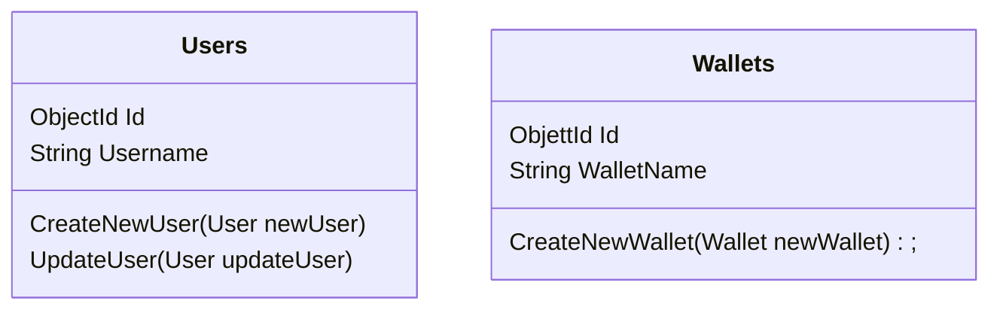

```mermaid
classDiagram

    class Users {
        ObjectId Id
        String Username

        CreateNewUser(User newUser)
        UpdateUser(User updateUser)
    }

    class Wallets {
        ObjettId Id
        String WalletName

        CreateNewWallet(Wallet newWallet);
    }
```